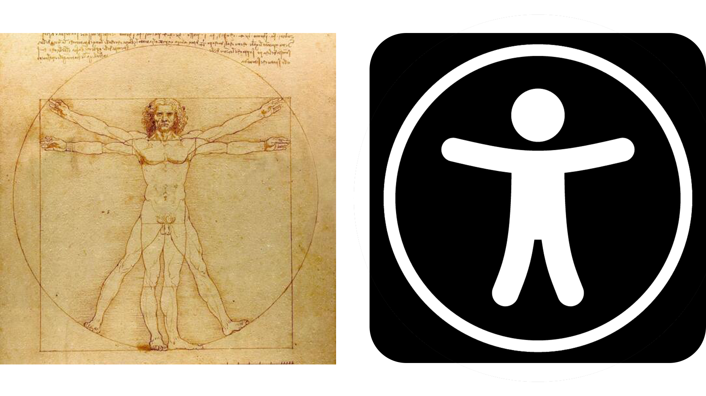

# Welcome To -- Yuba Technology!

[简体中文](../README.md)

  

## Organization Introduction

**Theory** is when you know everything but nothing works.

**Practice** is when everything works but no one knows why.

**In our organization**,theory and practice are combined:

Nothing works and no one knows why.

## Repositories

### Introduction

Our project mainly focuses on HTML (including CSS and JS) and Python.

   

 

We focus on the development of barrier free software systems. We firmly believe that the progress of science and technology is to **help everyone better**, which is the humanistic feelings and essence of scientific and technological innovation.

In 1487, Leonardo da Vinci drew the painting of the Vitruvian, hoping to express the perfect human proportions.

More than 500 years later, engineers developed the "Auxiliary Function" technology, hoping to make everyone a perfect person.

However, whether we are perfect or not, please remember that we humans are just supporting each other through this life.

### LICENSE

All our projects are open source in accordance with the ***"Anti 996" License***.

## Contact

**Yuba Technology**

Address:The Foggy City